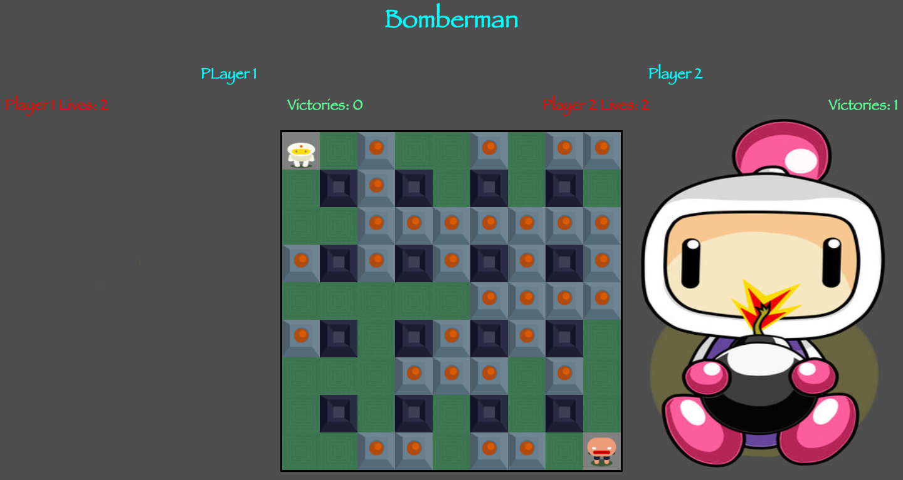

# Bomberman

## Play it
[To play the game click me](https://pdaneshyar.github.io/bomberman/)

## Objective
The task was to design a browser-based game using CSS, HTML, Javascript and Jquery.
The time period was 5 days to complete the project.

## Functionality
My game is based on the classic Bomberman and is a two player game. The aim is to blow up the other player until they run out of lives.

Main functionality:

* The map is randomly generated every time.                  
* The players are able to move, destroy blocks and each other as well as collect powerups.                        
* Players can enter their own names to display on screen.   
* The lives and number of wins for each player are displayed on screen.                                      
* The game features audio as well.

## Planning and Implementation 
Initially the design was for the most basic requirements to be met, these were: 
* instructions
* a game map
* a moveable character that can drop bombs
* scores displayed
* a beginning and ending to the game

From here more features were added including:
* styling the page
* audio clips where appropriate
* powerups to increase the number of bombs players can drop
* a play again option after a match is finished
* a second player that is fully functioning

## Game Design
The game map is generated from an array of numbers where each number signifies a different element of the game
```
var map = [[4,1,0,0,0,0,0,0,0],         // make an array for displaying the map
           [1,3,0,3,0,3,0,3,0],         // 1 = <div class="empty"></div>
           [0,0,0,0,0,0,0,0,0],         // 2 = <div class="breakable"></div>
           [0,3,0,3,0,3,0,3,0],         // 3 = <div class="non-breakable"></div>
           [0,0,0,0,0,0,0,0,0],         // 4 = <div class="player1"></div>
           [0,3,0,3,0,3,0,3,0],         // 5 = <div class="player2"></div>
           [0,0,0,0,0,0,0,0,0],         // 6 = <div class="bomb"></div>    
           [0,3,0,3,0,3,0,3,1],         // 7 = <div class="flame"></div>
           [0,0,0,0,0,0,0,1,5]];        // 8 = <div class="bombUpgrade"></div>       
```
Each time an action takes place the values are changed accordingly and the world is redrawn to match. 
Each div is styled with CSS to look like the approriate elements.



## Bugs
* player icon does not display until moved if killed on its' starting tile
* display does not resize when screen size changes

## Future improvements
* more powerups to increase flame range of bombs
* option to have more players
* pause option - completed
